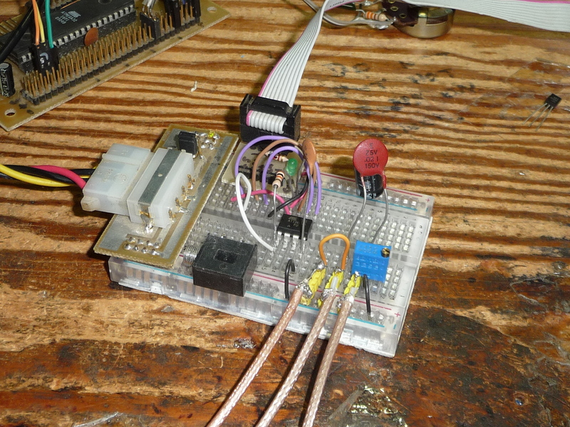
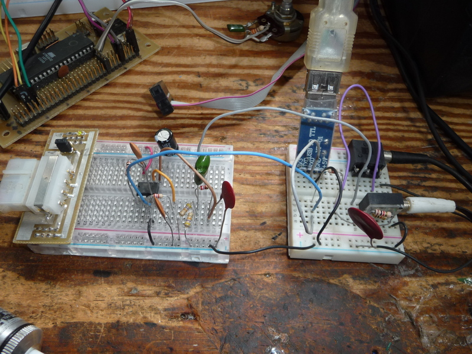

# powerBread
Molex power adapter for breadboards.

** I do not use this with a high current power supply **

And I OFTEN short the rails, so I'm glad I dont.
There is no current protection on this board, so be careful.

The top rail is configurable between 5 or 12V. The power led comes off this configurable rail, so make sure the LED resistor value is good for 12V, its intentional that it be dimmer at 5V, gies you a clue what voltage your set to.

The bottom rails has an extra two pins on the left. THESE PINS GO UP!!! They are meant for clipping alligator clips to for grounds, not going into the breadboard. 

The resistor and LED are 0805 surface mount parts (YOU CAN DO IT!) 

I use this with molex connectors like (hopefully this link lives a while) https://vi.aliexpress.com/item/1005005555699253.html

photos of my old one as a refrence:

